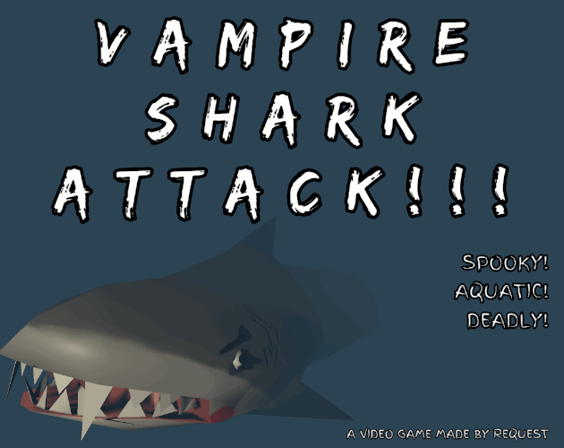

# Vampire Shark Attack!!!

A stealthy game, where you have to swim through dangerous vampire-shark-infested waters. This was my submission to the ["VR with Andrew's Spooky VR Jam 2020"](https://itch.io/jam/vr-with-andrews-spooky-vr-jam) game jam.

    

You can download the game for free [here, on itch.io](https://request.itch.io/vampire-shark-attack), 
or you can check out my other projects at [request.moe](https://request.moe). 
If you're interested, you can check out the [postmortem](./postmortem.md) for this project.

You're free to do whatever with this code, but if you do use it, it'd be real cool of you to link back to this page or the itch.io page (or both). Thanks!

### Assets

  * Engine: Unity 2019.4.5f1
	  * URP
  * SFX / BGM
    * [Low Fi, by Pro Sensory](https://opengameart.org/content/low-fi-0), licensed under [CC0](http://creativecommons.org/publicdomain/zero/1.0/)
    * [Door Open/Close, by qubodup](https://opengameart.org/content/door-open-door-close-set), licensed under [CC0](http://creativecommons.org/publicdomain/zero/1.0/)
    * [Horror SFX Library, by Little Robot Sound Factory](https://opengameart.org/content/horror-sound-effects-library), licensed under [CC3.0](http://creativecommons.org/licenses/by/3.0/)
    * [Glass Shatter, by spookymodem](https://opengameart.org/content/breaking-bottle), licensed under [CC3.0](http://creativecommons.org/licenses/by/3.0/)
  * Models
    * [Padlock, by Savino](https://opengameart.org/content/padlock), licensed under [CC0](http://creativecommons.org/publicdomain/zero/1.0/)
    * [Low Poly Shark mesh, by pennomi](https://opengameart.org/content/low-poly-shark), licensed under [CC0](http://creativecommons.org/publicdomain/zero/1.0/)
    * [Graveyard Kit, by Kenney](https://www.kenney.nl/assets/graveyard-kit), licensed under [CC0](http://creativecommons.org/publicdomain/zero/1.0/)
    * [Watercraft Kit, by Kenney](https://www.kenney.nl/assets/watercraft-pack), licensed under [CC0](http://creativecommons.org/publicdomain/zero/1.0/)
    * [Potions and Materials, by Verex](https://www.patreon.com/Verex), licensed under [CC0](http://creativecommons.org/publicdomain/zero/1.0/)
   
